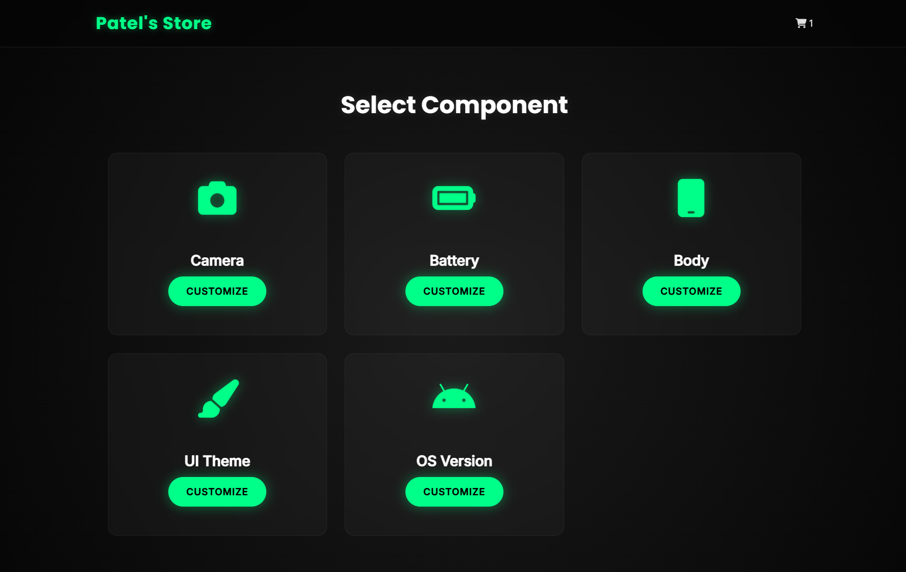
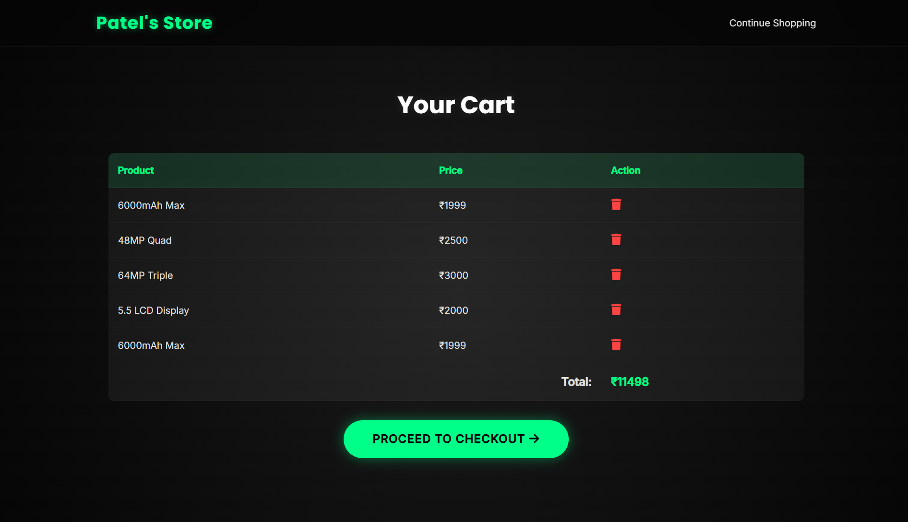
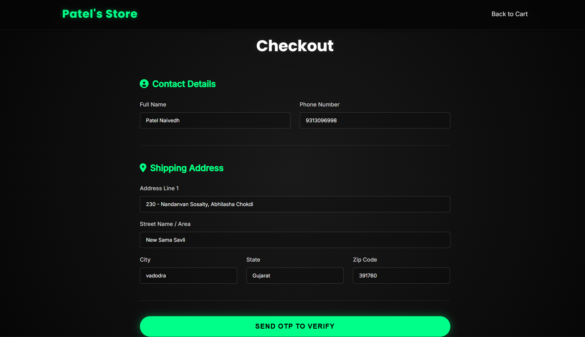

# 🛍️ E-commerce Website  

A responsive and modern **E-commerce Website** designed with the help of **HTML, CSS, and JavaScript**.
This project features a professional layout, smooth animations, and clean responsive design for mobile devices.

LIVE🔴 🔗 **Live Demo:** ([https://naivedhp2518.github.io/E-commmerce-website/](https://naivedhp2518.github.io/E-commmerce-website-For-Mobail-Store))

---

## 🛠 Features  
- Responsive design (mobile, tablet & desktop)  
- Smooth scrolling with modern navigation bar  
- Home, Services, About, and Contact pages
- Background images and animations (AOS integrated)  
- Clean and minimal UI  

---

## 💻🖱️ Technologies Used  
- **HTML5** – Structure  
- **CSS3** – Styling & Animations  
- **JavaScript** – Interactivity  
- **AOS Library** – Scroll animations  

---

| Homepage Hero | Features/Services | Content/Information | Footer/Contact |
|---------------|-------------------|---------------------|----------------|
|  |  |  |  |
  

---

## 📋 Project Setup  
1. Clone the repository:
```bash
   git clone https://github.com/naivedhP2518/E-commmerce-website.git
```

